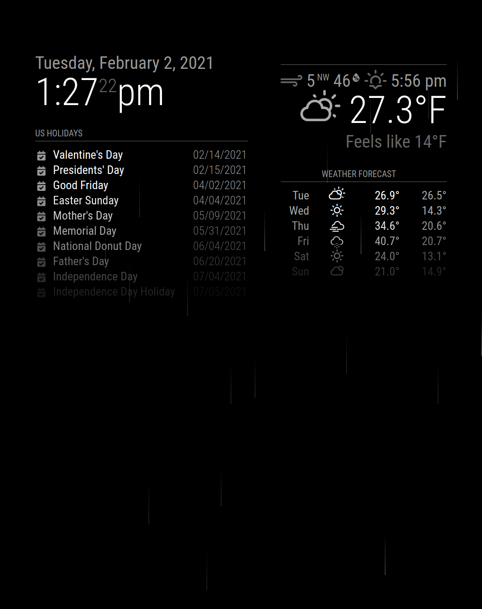
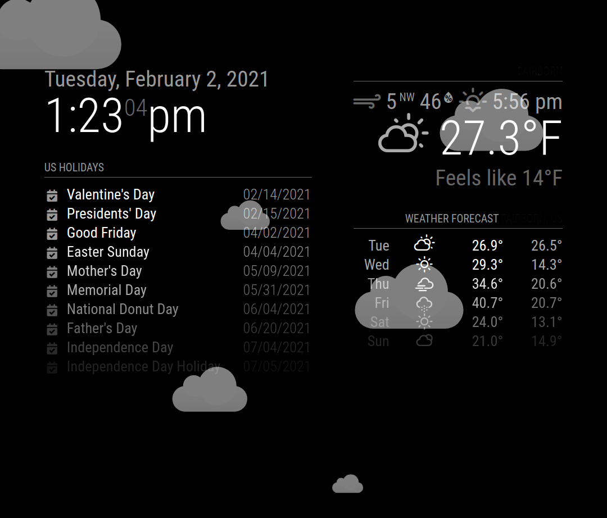

# Module: MMM-DynamicWeather
Inspired by [MichMich's Snow Plugin](https://github.com/MichMich/MMM-Snow) I added rain and clouds as well as automatically toggling the effects based on the current weather and date.

**Rain**



**Cloudy**



## Installation

In your terminal, go to your MagicMirror's Module folder:
````
cd ~/MagicMirror/modules
````

Clone this repository:
````
git clone https://github.com/scottcl88/MMM-DynamicWeather.git
````

Configure the module in your `config.js` file.

**Note:** After starting the Mirror, it will take a few seconds before any effects may show. If its clear skies, nothing will be seen unless its February 14 (which shows hearts).

## Updating
Go to the DynamicWeather module
````
cd ~/MagicMirror/modules/MMM-DynamicWeather
````
Run NPM Install
````
npm install mmm-dynamicweather
````

## Using the module

To use this module, add it to the modules array in the `config/config.js` file:
````javascript
{
	module: 'MMM-DynamicWeather',
	position: 'fullscreen_above',
	config: { // See https://github.com/scottcl88/MMM-DynamicWeather for more information.
		api_key: "f9cf757d2ef008ec0b085af1b7f5c58a",
		locationID: "4511263",
		effects: [
			{
				month: "2",
				day: "14",
				year: "2021",
				images: ["heart1.png", "heart2.png"],
				direction: "up"
			}
		],
	}
},
````

## Configuration options

The following properties can be configured:

|Option|Description|
|---|---|
|`alwaysDisplay`|Set this to always display the specified effect.<br><br>**Options:** `snow`, `rain`, `cloudy`<br>**Type:** `string`<br>**Default value:** `null`|
|`api_key`|**Required** This is the API key you need to use to request weather data from the OpenWeatherMap site.  Details on how to request an API key can be found [here](https://home.openweathermap.org/users/sign_up)<br><br>**Type:** `string`<br>**Default value:** `null`|
|`effectDuration`|The length, in milliseconds, to display the effect. <br><br>**Type:** `number`<br>**Default value:** `120000`|
|`effectDelay`|The length, in milliseconds, to wait to restart the effect. <br><br>**Type:** `number`<br>**Default value:** `60000`|
|`hideSnow`|If true, will never display the "snow" effect. <br><br>**Type:** `boolean`<br>**Default value:** `false`|
|`hideRain`|If true, will never display the "rain" effect. <br><br>**Type:** `boolean`<br>**Default value:** `false`|
|`hideClouds`|If true, will never display the "cloudy" effect. <br><br>**Type:** `boolean`<br>**Default value:** `false`|
|`locationID`|**Required (or use lat/lon)**<br><br>**Type:** `integer`<br>**Default value:** `0`|
|`lat`|**Required with lon (or use locationID)** This is the latitude of the location you want to get the weather for.<br><br>**Type:** `number`<br>**Default value:** `0.0`|
|`lon`|**Required with lat (or use locationID)** This is the longitude of the location you want to get the weather for.<br><br>**Type:** `number`<br>**Default value:** `0.0`|
|`particleCount`|The number of particles to show for each effect. Higher counts may cause performance issues.<br><br>**Type:** `integer`<br>**Default value:** `100`|
|`weatherInterval`|How often the weather is updated.<br><br>**Type:** `integer`<br>**Default value:** `600000 // 10 minutes`|
|`zIndex`|Sets the z-index of the module's wrapper, in case of other elements being blocked.<br><br>**Type:** `number`<br>**Default value:** `99`|

Effect options
|Option|Description|
|---|---|
|`direction`|<br><br>**Type:** `string`<br>**Default value:** `up`|
|`month`|The month (1-12) of the date to display this effect on.<br><br>**Type:** `number`<br>**Default value:** `0`|
|`day`|The day of the month (1-31) of the date to display this effect on.<br><br>**Type:** `number`<br>**Default value:** `0`|
|`year`|The year (4 digits) of the date to display this effect on.<br><br>**Type:** `number`<br>**Default value:** `0`|
|`images`|An array of image files to display at random for this effect.<br><br>**Type:** `string[]`<br>**Default value:** `null`|
|`size`|The size factor to display the image; larger the number the larger the picture.<br><br>**Type:** `number`<br>**Default value:** `1`|
|`weatherCode`|The effect will be displayed whenever the current weather matches this code. You can find all valid codes [here](https://openweathermap.org/weather-conditions)<br><br>**Type:** `number`<br>**Default value:** `0`|

